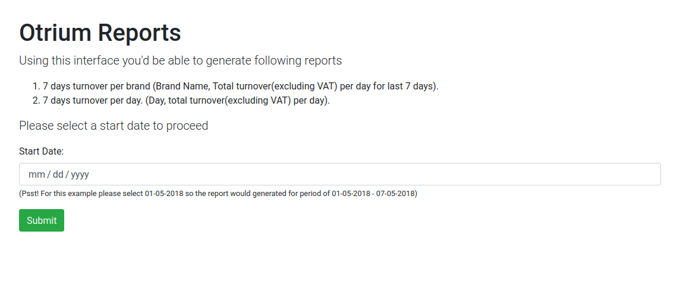

# Otrium Reports
## Setup
- Create `.env` file from `.env.example` and configure it correctly.
```shell
DATABASE_NAME=otrium
DATABASE_USER=otrium
DATABASE_PASSWORD=otrium
HOST_PORT=8080
DATABASE_PORT=3306
```

- Build development env with docker.
```shell
docker-compose up -d --build
```
- Execute `docker-composer ps` list containers

```shell
➜  otrium-reports git:(master) docker-compose ps           
    Name                  Command               State                          Ports                       
-----------------------------------------------------------------------------------------------------------
otrium_app     docker-php-entrypoint php-fpm    Up      0.0.0.0:9001->9000/tcp,:::9001->9000/tcp           
otrium_db      docker-entrypoint.sh --def ...   Up      0.0.0.0:5306->3306/tcp,:::5306->3306/tcp, 33060/tcp
otrium_nginx   /docker-entrypoint.sh ngin ...   Up      0.0.0.0:8070->80/tcp,:::8070->80/tcp 
```
- Update dependencies with following command
```shell
docker-compose exec app composer install
```
- Give permissions to `web/reports` directory
```shell
sudo chmod 777 -R web/reports
```
- Navigate to `localhost:8080` and would be presented with the report generation page.

  
- Runt tests
```shell
docker-compose exec app ./vendor/bin/phpunit tests 
```